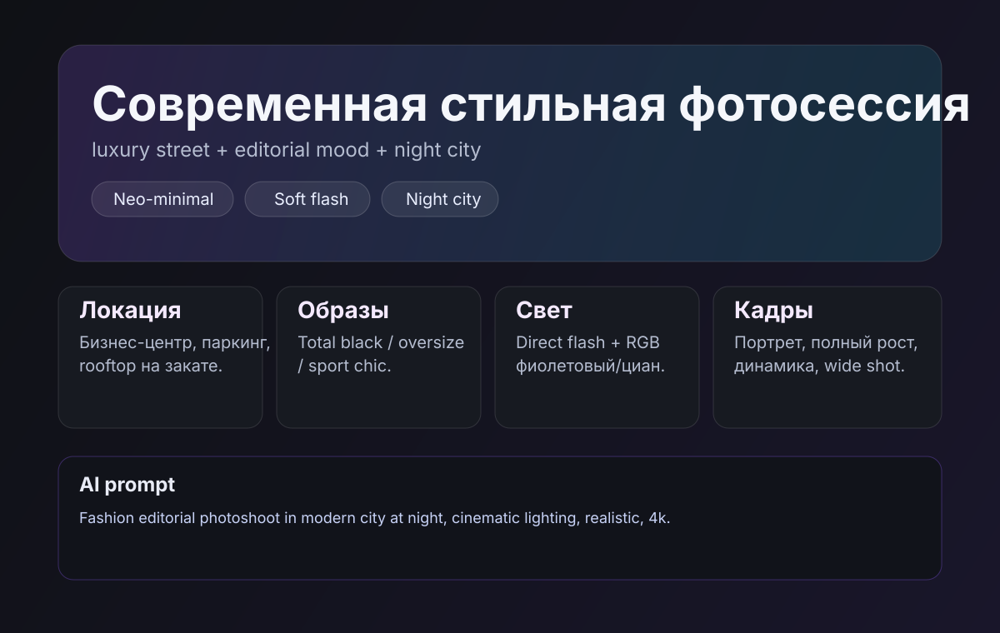

# codex-vibecoding

Современная стильная фотосессия в формате простой веб-страницы (`index.html`).

## Быстрый просмотр (без сервера)

Если у тебя не открывается HTML, используй постоянное превью из репозитория:



> Важно: временные ссылки формата `browser:/...` могут не открываться вне сессии. Для стабильного просмотра используй `preview.svg` из репозитория.

## Если страница не открывается

Попробуй один из вариантов:

1. **Открыть напрямую:** дважды кликни по `index.html`.
2. **Через локальный сервер:**

```bash
python3 -m http.server 8000
```

Далее открой `http://localhost:8000/index.html`.

## Концепция фотосессии (текстом)

- **Стиль:** neo-minimal, luxury street, editorial mood.
- **Локации:** стеклянный бизнес-центр, паркинг, rooftop.
- **Образы:**
  - Look A: total black + кожаная куртка
  - Look B: oversize-пиджак + белый топ + серебро
  - Look C: sport chic + акцентные очки
- **Свет:** direct flash + RGB (фиолетовый/циан), отражения в стекле.
- **Кадры:** портрет крупно, ростовые, движение, детали украшений, кадр через витрину.

### AI-промпт для референсов

> Fashion editorial photoshoot of a confident young person in a modern city at night, neo-minimal styling, black and silver outfit, cinematic lighting, soft direct flash, reflections on glass, subtle fog, high detail skin texture, magazine cover composition, 35mm and 85mm lens look, luxury streetwear aesthetic, purple and cyan accents, realistic, ultra sharp, 4k.
